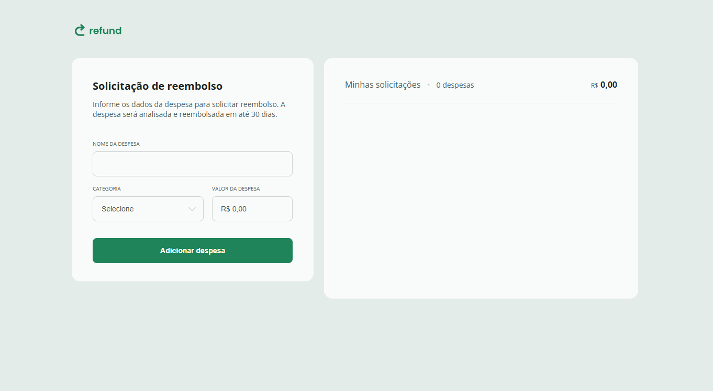

# Controle de Despesas Pessoais

Este é um projeto acadêmico desenvolvido durante a formação **Desenvolvedor Full Stack pela Rocketseat**, com a mentoria de **Marcelo Gonçalves**. O objetivo do projeto foi criar uma página dinâmica e responsiva para controle de despesas diárias, permitindo categorizar gastos e calcular automaticamente o total de despesas.

A página foi desenvolvida utilizando **HTML**, **CSS**, **JavaScript** e **Figma** para o design. O JavaScript foi utilizado para toda a lógica de backend, incluindo cálculos e manipulação dos dados. O projeto foi feito com foco em responsividade e design moderno.

## 🚀 Funcionalidades

- Adicionar despesas diárias.
- Categorizar despesas (alimentação, transporte, outros, etc.).
- Cálculo automático do total de gastos.
- Design responsivo e moderno.

## 🛠️ Tecnologias Utilizadas

- **HTML5**: Estruturação da página.
- **CSS3**: Estilização da página.
- **JavaScript**: Lógica de backend e manipulação de dados.
- **Figma**: Design da interface.
- **Microsoft Edge**: Navegador utilizado para desenvolvimento.

## 📂 Estrutura do Projeto

Estrutura de Pastas

```plaintext
sistema-de-despesas/
│── img/
│   ├── screenshot.png
│── index.html
│── styles.css
│── index.js
│── README.md
```

## 🔧 Como Executar o Projeto

1. Clone este repositório:

   ```bash
   git clone https://github.com/devmoisessantos/sistema-de-despesas.git
   ```

2. Acesse a pasta do projeto:

   ```bash
   cd sistema-de-despesas
   ```

3. Abra o arquivo `index.html` no navegador.

## 🌎 Deploy

O projeto está disponível online: **[AQUI](https://sistema-de-despesas.vercel.app/)**

---

## 📌 Melhorias Futuras

- Adicionar gráficos para visualização de gastos por categoria.
- Implementar um sistema de login para salvar despesas por usuário.
- Adicionar suporte para múltiplas moedas.

## 🤝 Contribuição

Sinta-se à vontade para abrir issues e enviar pull requests para melhorias!

- Faça um fork do projeto.
- Crie uma nova branch para sua feature (`git checkout -b minha-feature`).
- Comite suas alterações (`git commit -am 'Adiciona nova feature'`).
- Envie para o repositório remoto (`git push origin minha-feature`).
- Abra um Pull Request.

---

## 🔗 Links

🔗 [LinkedIn](https://www.linkedin.com/in/devmoises-santos)  
🐙 [GitHub](https://github.com/devmoisessantos)  
📧 [Email](mailto:devmoisessantos@gmail.com)

📌 **Desenvolvido por Moisés M. Santos** 🚀
